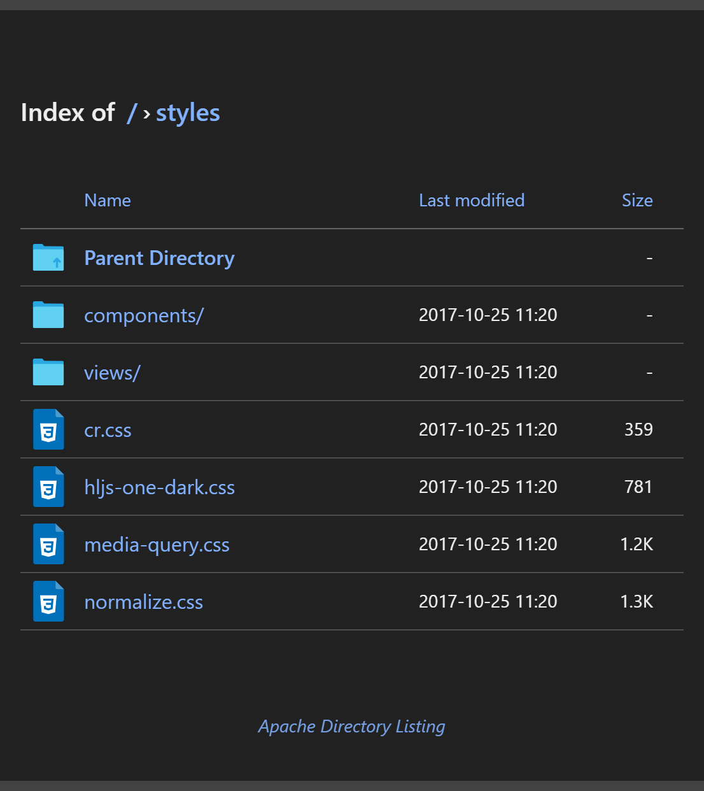

# Apache Styled

Stylized Apache to look better. Just run the container and put your files in `/usr/local/apache2/htdocs`.

## Credits
* Apache Directory Listing
* Icons referenced from [File Types Icons Set](https://web.archive.org/web/20161030160003/http://uifest.com/product/file-types-icons-set).

## License
[MIT](license.txt)
